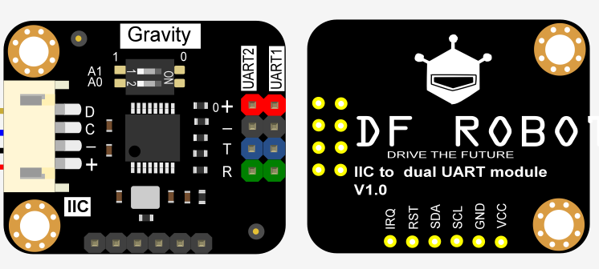

# DFRobot_IICSerial

- [English Version](./README.md)

这是一款IIC转双串口的UART模块，IIC最高速率为1Mbps。每个子串口具备收/发独立的256字节FIFO硬件缓存，可以满足用户大量数据传输的场景。<br>
每个子串口的波特率，字长，校验格式可独立设置，最高提供2M bps的通信速率，支持4个IIC地址，一块主控上最多并联4个模块，一次最多扩展8个硬串口。<br>




## 产品链接（[https://www.dfrobot.com.cn/goods-2668.html](https://www.dfrobot.com.cn/goods-2668.html)）
    SKU: DFR0627 

## 目录

  * [概述](#概述)
  * [库安装](#库安装)
  * [方法](#方法)
  * [兼容性](#兼容性)
  * [历史](#历史)
  * [创作者](#创作者)

## 概述

1. 波特率设置；<br>
2. 串口数据读；<br>
3. 串口数据写；<br>

## 库安装
1. 下载库至树莓派，要使用这个库，首先要将库下载到Raspberry Pi，命令下载方法如下:<br>
```python
sudo git clone https://github.com/DFRobot/DFRobot_IICSerial
```
2. 打开并运行例程，要执行一个例程demo_x.py，请在命令行中输入python demo_x.py。例如，要执行demo_read_serial.py例程，你需要输入:<br>

```python
python demo_read_serial.py 
或 
python2 demo_read_serial.py 
或 
python3 demo_read_serial.py
```

## 方法

```python
  '''!
    @brief 构造函数
    @param sub_uart_channel 子串口通道, WK2132有2个子串口通道: SUBUART_CHANNEL_1 或 SUBUART_CHANNEL_2
    @Parame IA1:  对应模块上的拨码开关IA1的电平（0或1），用于配置IIC地址第6位的值，默认为1
    @Parame IA0:  对应模块上的拨码开关IA0的电平（0或1），用于配置IIC地址第5位的值，默认为1
    @n 第5位值的IIC地址（默认：1）
    @n IIC地址配置: 
    @n 7   6   5   4   3   2   1   0
    @n 0  IA1 IA0  1   0  C1  C0  0/1
    @n IIC 地址只有 7 位，而一个字节有 8 位，所以多出来的一位将被填充为 0。
    @n 第6位值对应拨码开关的IA1，可手动配置
    @n 第5位值对应拨码开关的IA0，可手动配置
    @n 第4/3位为固定值，分别为1/0
    @n 第2/1位的值为子串口通道，00表示子串口1，01表示子串口2
    @n 第0位表示操作对象是寄存器还是FIFO缓存，0表示寄存器，1表示FIFO缓存
  '''
  def __init__(self, sub_uart_channel, IA1 = 1, IA0 =1):
  
  '''!
    @brief 初始化函数，设置子UART频段速率，数据格式
    @param baud: 波特率，支持: 9600, 57600, 115200, 2400, 4800, 7200,
    @n     14400, 19200, 28800,38400, 76800, 153600, 230400, 460800, 307200, 921600
    @param format: 数据格式,支持以下数据格式:
    @n     IIC_SERIAL_8N1, IIC_SERIAL_8N2, IIC_SERIAL_8Z1,IIC_SERIAL_8Z2
    @n     IIC_SERIAL_8O1, IIC_SERIAL_8O2, IIC_SERIAL_8E1, IIC_SERIAL_8E2
    @n     IIC_SERIAL_8F1, IIC_SERIAL_8F2
    @return 如果成功则返回 0，否则返回非零
  '''
  def begin(self, baud, format = IIC_Serial_8N1):
  
  '''!
    @brief 关闭传感器，再次使用需调用begin
  '''
  def end(self):
  
  '''!
    @breif 将值打印到流中，用法与打印功能相同。
    @param sep: 在值之间插入字符串，默认为空格。
    @param end: 在最后一个值之后附加的字符串，默认为换行符。
  '''
  def printf(self, *args, **kargs):
  
  '''!
    @brief 获取接收缓冲区的字节数，它应该是FIFO n接收缓冲区（256B）和自定义_rx_buffer（31B）的总字节数。
    @return 返回接收缓冲区中的字节数
  '''
  def available(self):
  
  '''!
    @brief 返回 1 个字节的数据，不删除接收缓冲区中的数据
    @return 返回读取的字符
  '''
  def peek(self):
  
  '''!
    @brief 从串口读取 size 个字节，该操作将删除缓冲区中的数据。
    @param size: 读取的字节
    @return 返回实际读取的字节数
  '''
  def read(self, size = 1):
  
  '''!
    @brief 等待数据传输完毕
  '''
  def flush(self):
  
  '''!
    @brief 通过串口输出给定的字节串。
    @param value: 字节串
    @return 实际写入的字节。
  '''
  def write(self, value):
  
```

## 兼容性

| 主板         | 通过 | 未通过 | 未测试 | 备注 |
| ------------ | :--: | :----: | :----: | :--: |
| RaspberryPi2 |      |        |   √    |      |
| RaspberryPi3 |      |        |   √    |      |
| RaspberryPi4 |  √   |        |        |      |

* Python 版本

| Python  | 通过 | 未通过 | 未测试 | 备注 |
| ------- | :--: | :----: | :----: | ---- |
| Python2 |  √   |        |        |      |
| Python3 |  √   |        |        |      |

## 历史

- 2021/05/19 - 1.0.0 版本

## 创作者

Written by Arya(xue.peng@dfrobot.com), 2021. (Welcome to our [website](https://www.dfrobot.com/))


